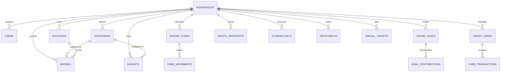

# 5. Database Schema & Data Models

## 1. Schema Overview

The database contains **18 core tables** implemented in PostgreSQL (Supabase / Prisma) and mirrored in Drift SQLite for local offline storage.

All financial amounts are strictly stored as **32-bit / 64-bit integer paise** (`INTEGER` / `Int`), ensuring 1:1 type compatibility and zero floating-point rounding errors across PostgreSQL, Drift SQLite, and Dart.

---

## 2. Entity-Relationship Diagram

---

## 3. Table-by-Table Reference

### 1. `households`
Multi-tenant isolation root for sharing budgets and ledger entries across household members.
| Column | Type | Constraints | Description |
|---|---|---|---|
| `id` | `TEXT` / `UUID` | PRIMARY KEY | Unique household ID |
| `name` | `TEXT` | NOT NULL | Household name (e.g. "Sharma Family") |
| `owner_id` | `TEXT` | NOT NULL | User ID of household owner / creator |
| `created_at` | `TIMESTAMPTZ` | DEFAULT `NOW()` | Creation timestamp |
| `updated_at` | `TIMESTAMPTZ` | DEFAULT `NOW()` | Modification timestamp |

---

### 2. `users`
Stores user profile, authentication mapping, and active household membership.
| Column | Type | Constraints | Description |
|---|---|---|---|
| `id` | `TEXT` / `UUID` | PRIMARY KEY | Unique user ID |
| `email` | `TEXT` | NOT NULL, UNIQUE | User email address |
| `password` | `TEXT` | NULLABLE | Salted SHA-256 password hash (null for OAuth) |
| `display_name` | `TEXT` | NOT NULL | User's full name |
| `household_id` | `TEXT` | NULLABLE | Currently active household partition |
| `auth_provider` | `TEXT` | DEFAULT `'email'` | `'email'`, `'google'`, or `'offline'` |
| `created_at` | `TIMESTAMPTZ` | DEFAULT `NOW()` | Registration timestamp |

---

### 3. `accounts`
Stores liquid cash and bank accounts.
| Column | Type | Constraints | Description |
|---|---|---|---|
| `id` | `TEXT` | PRIMARY KEY | Unique account ID |
| `household_id` | `TEXT` | NOT NULL | Household isolation key |
| `name` | `TEXT` | NOT NULL | E.g. "HDFC Savings", "Cash Wallet" |
| `type` | `TEXT` | NOT NULL | `'savings'`, `'checking'`, `'cash'`, `'investment'` |
| `current_balance_paise` | `INTEGER` | DEFAULT `0` | Current verified balance in paise |
| `is_active` | `BOOLEAN` | DEFAULT `true` | Soft toggle |
| `sort_order` | `INTEGER` | DEFAULT `0` | UI display ordering |

---

### 4. `categories`
Taxonomy of financial classifications (~141 seeded categories).
| Column | Type | Constraints | Description |
|---|---|---|---|
| `id` | `TEXT` | PRIMARY KEY | Unique category ID |
| `household_id` | `TEXT` | NOT NULL | Household isolation key |
| `kind` | `TEXT` | NOT NULL | `'income'`, `'adjustment'`, `'spending'`, `'protection'`, `'saving'` |
| `group_code` | `TEXT` | NULLABLE | Group code: `'fees'`, `'needs'`, `'wants'`, `'travel'`, `'honorarium'`, etc. |
| `name` | `TEXT` | NOT NULL | E.g. "Groceries", "Dining Out", "Life Insurance" |
| `need_or_want` | `TEXT` | NULLABLE | `'need'` vs. `'want'` classification |
| `is_deduction` | `BOOLEAN` | DEFAULT `false` | **Critical**: If `true`, subtracts from adjustments total |
| `is_system` | `BOOLEAN` | DEFAULT `false` | If true, cannot be renamed or deleted |
| `sort_order` | `INTEGER` | DEFAULT `0` | UI order |
| `archived_at` | `TIMESTAMPTZ`| NULLABLE | Deletion/archive timestamp |

---

### 5. `budgets`
Monthly planned limits assigned per category.
| Column | Type | Constraints | Description |
|---|---|---|---|
| `id` | `TEXT` | PRIMARY KEY | Unique budget ID |
| `household_id` | `TEXT` | NOT NULL | Household key |
| `category_id` | `TEXT` | FOREIGN KEY (`categories.id`) | Target category (Cascades on Delete) |
| `year_month` | `TEXT` | NOT NULL | Year-month string, e.g. `'2026-09'` |
| `amount_paise` | `INTEGER` | DEFAULT `0` | Budgeted limit in paise |
| *Constraint* | `UNIQUE(category_id, year_month)` | UNIQUE constraint | One budget per category per month |

---

### 6. `entries`
The primary double-entry financial transaction ledger.
| Column | Type | Constraints | Description |
|---|---|---|---|
| `id` | `TEXT` | PRIMARY KEY | Unique transaction ID |
| `household_id` | `TEXT` | NOT NULL | Household key |
| `category_id` | `TEXT` | FOREIGN KEY (`categories.id`) | Category assignment (Cascades on Delete) |
| `kind` | `TEXT` | NOT NULL | `'income'`, `'expense'`, `'adjustment'`, `'transfer'` |
| `account_id` | `TEXT` | NULLABLE | Originating bank/cash account |
| `card_id` | `TEXT` | NULLABLE | Associated credit card |
| `entry_date` | `TIMESTAMPTZ` | NOT NULL | Date and time of transaction |
| `amount_paise` | `INTEGER` | NOT NULL | Always positive integer paise amount |
| `note` | `TEXT` | NULLABLE | User description / note |
| `parent_id` | `TEXT` | NULLABLE | For split transactions |
| `created_by` | `TEXT` | NOT NULL | User ID who logged entry |
| `version` | `INTEGER` | DEFAULT `1` | Optimistic locking / sync version |
| `created_at` | `TIMESTAMPTZ` | DEFAULT `NOW()` | Creation timestamp |
| `updated_at` | `TIMESTAMPTZ` | DEFAULT `NOW()` | Modification timestamp |
| `deleted_at` | `TIMESTAMPTZ` | NULLABLE | Soft-delete timestamp for sync |

---

### 7. `sinking_funds` & `fund_movements`
Protection sinking funds (Layer 2) tracking cumulative reserves.
- **`sinking_funds`**: `id`, `household_id`, `name`, `opening_reserve_paise` (`INTEGER`), `archived_at`.
- **`fund_movements`**: `id`, `fund_id` (FK to `sinking_funds`, CASCADE), `type` (`'inflow'`, `'outflow'`), `amount_paise` (`INTEGER`), `movement_date`, `note`.

---

### 8. `saving_goals` & `goal_contributions`
Goal-oriented savings (Layer 3).
- **`saving_goals`**: `id`, `household_id`, `bucket` (`'retirement'`, `'children'`, `'custom'`), `name`, `target_paise` (`INTEGER`, nullable), `monthly_budget_paise` (`INTEGER`), `archived_at`.
- **`goal_contributions`**: `id`, `goal_id` (FK to `saving_goals`, CASCADE), `amount_paise` (`INTEGER`), `contribution_date`, `note`.

---

### 9. `credit_cards` & `card_transactions`
Credit card debt and monthly billing cycles.
- **`credit_cards`**: `id`, `household_id`, `name`, `previous_outstanding_paise` (`INTEGER`), `isActive` (`BOOLEAN`).
- **`card_transactions`**: `id`, `card_id` (FK to `credit_cards`, CASCADE), `txn_date`, `description`, `amount_paise` (`INTEGER`), `s_no`.

---

### 10. `receivables`
Informal lending and receivables tracking.
- `id` (`TEXT` PK), `household_id`, `person_name`, `amount_paise` (`INTEGER`), `status` (`'open'` / `'returned'`), `due_date`, `entry_id` (Nullable link to ledger entry).

---

### 11. `planned_bills`
Forecasted forward commitments and recurring bills.
- `id` (`TEXT` PK), `household_id`, `name`, `amount_paise` (`INTEGER`), `due_date`, `is_paid` (`BOOLEAN`), `entry_id` (Nullable link to ledger entry).

---

### 12. `reserve_lines`
Custom month-specific reserve buffer allocations.
- `id` (`TEXT` PK), `household_id`, `year_month`, `name`, `amount_paise` (`INTEGER`), `source` (`'manual'` / `'derived'`).

---

### 13. `annual_targets`
High-level annual milestone targets.
- `id` (`TEXT` PK), `household_id`, `title`, `target_paise` (`INTEGER`), `type` (DEFAULT `'income'`).

---

### 14. `month_snapshots`
Sealed monthly financial statements capturing the exact state of the 7-layer waterfall.
| Column | Type | Description |
|---|---|---|
| `id` | `TEXT` (PK) | Snapshot ID |
| `household_id` | `TEXT` | Household key |
| `year_month` | `TEXT` | Formatted `'YYYY-MM'` |
| `opening_balance_paise` | `INTEGER` | Actual start balance |
| `last_month_reserves_paise` | `INTEGER` | Carried-in reserves |
| `income_paise` | `INTEGER` | Total income |
| `adjustments_paise` | `INTEGER` | Total net adjustments |
| `spending_paise` | `INTEGER` | Total actual spend |
| `protection_paise` | `INTEGER` | Total protection allocated |
| `saving_paise` | `INTEGER` | Total savings allocated |
| `reserves_paise` | `INTEGER` | Earmarked reserve |
| `closing_balance_paise` | `INTEGER` | Verified bank closing balance |
| `remaining_paise` | `INTEGER` | Surplus = Inflow - Outflow |
| `status` | `TEXT` | `'open'` or `'closed'` |
| `closed_at` | `TIMESTAMPTZ` | Timestamp of month closure |
| *Constraint* | `UNIQUE(household_id, year_month)` | Single snapshot per household per month |

---

### 15. `sync_queue`
Local SQLite & server table storing mutations waiting for cloud synchronization.
| Column | Type | Description |
|---|---|---|
| `id` | `TEXT` (PK) | Unique mutation ID |
| `op` | `TEXT` | `'CREATE'`, `'UPDATE'`, `'DELETE'` |
| `entity` | `TEXT` | Target entity table (e.g. `'entries'`) |
| `entity_id` | `TEXT` | Primary key of affected entity |
| `payload` | `TEXT` | JSON payload of the mutation |
| `created_at` | `TIMESTAMPTZ` | When mutation occurred |
| `attempts` | `INTEGER` | Number of failed sync attempts |
| `synced_at` | `TIMESTAMPTZ` | When sync succeeded |
