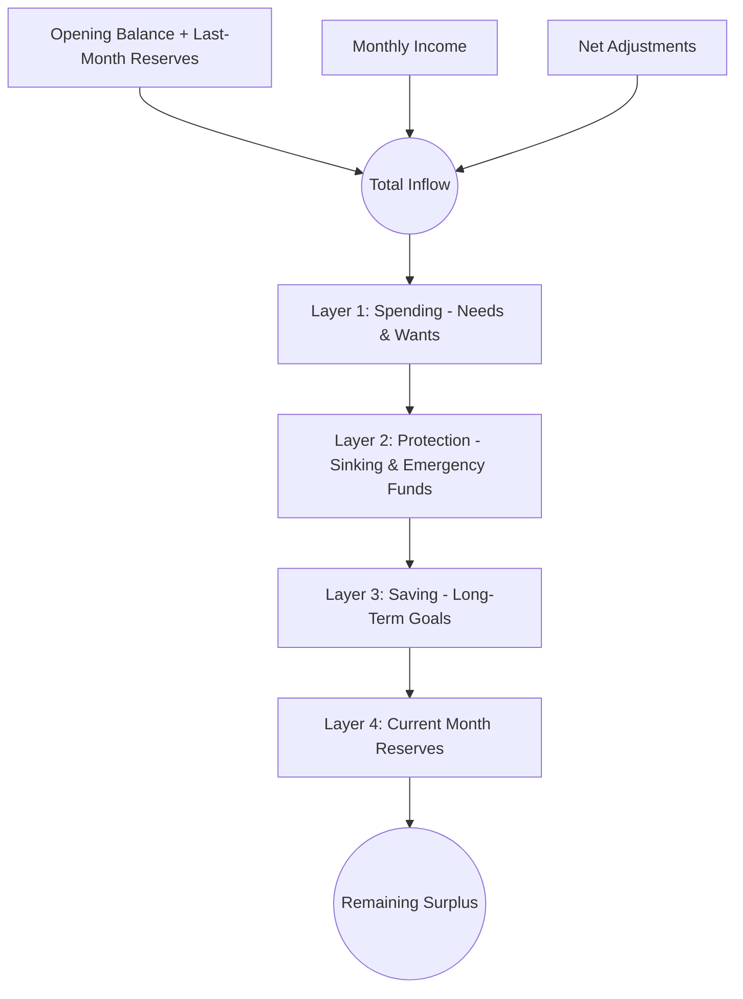

# 2. Financial Waterfall Engine

## 1. The Core Philosophy

The heart of Budget Tracker is a deterministic financial calculation engine reverse-engineered from a production-grade personal financial model (~1,550 Excel formulas).

Unlike naive budget apps that simply calculate `Income - Expenses = Balance`, this application processes monthly cash flows through a structured **7-layer waterfall** where money is systematically allocated toward survival, protection, future commitments, and reserves before arriving at unallocated discretionary surplus.

---

## 2. Integer Currency Representation (Paise)

Floating-point numbers in computers cannot accurately represent decimal currencies:
```text
0.10 + 0.20 = 0.30000000000000004  // ❌ Fatal in accounting
```

To eliminate any potential rounding bugs:
- **All financial fields are stored as 64-bit integers in paise** ($1\text{ INR} = 100\text{ paise}$).
- For example, `₹1,500.50` is stored as `150050`.
- All additions, subtractions, multiplications, and rollups are strictly integer operations.
- Conversion to human-readable strings occurs **only at the UI presentation boundary** via the `Money` entity and `IndianCurrencyFormatter`.

---

## 3. The 7-Layer Waterfall Formula

The fundamental invariant of the application is:

$$\begin{aligned}
\text{Total Inflow} &= \text{Opening Balance} + \text{Last Month Reserves} + \text{Income} + \text{Net Adjustments} \\
\text{Total Outflow} &= \text{Spending} + \text{Protection (Sinking Funds)} + \text{Saving (Goals)} + \text{Reserves (Carried Forward)} \\
\mathbf{\text{Remaining}} &= \mathbf{\text{Total Inflow} - \text{Total Outflow}}
\end{aligned}$$



---

## 4. Layer Breakdown & Business Rules

### 1. Inflow Components

1. **Opening Balance (`opening_balance_paise`)**:
   - The verified actual balance across all liquid accounts at the start of the month.
2. **Last-Month Reserves (`last_month_reserves_paise`)**:
   - Funds explicitly ring-fenced in the prior month that are released back into the inflow pool for the current month.
3. **Income (`income_paise`)**:
   - Primary salary, dividends, business revenue, interest, and bonuses.
4. **Net Adjustments (`adjustments_paise`)**:
   - Short-term cash movements that are neither standard income nor regular expenses (e.g., credit card repayments, borrowed money, temporary cash returns).

---

### ⚠️ Critical Rule: The Adjustment Sign Logic (4 Add / 2 Subtract)

Verified against Excel formula:
$$\text{Income!D23} = \sum(\text{D24:D27}) - \sum(\text{D28:D29})$$

Adjustment categories are split into two groups based on whether they increase or reduce the net cash available:

| Adjustment Category Name | `isDeduction` | Direction | Explanation |
|---|---|---|---|
| **Credit Card Borrow / Payment** | `false` | **ADD (+)** | Inward liquidity adjustment / borrowing |
| **Borrow / Return (+)** | `false` | **ADD (+)** | Inward loan received or return of borrowed funds |
| **Temporary In / Out (+)** | `false` | **ADD (+)** | Short-term cash inflow |
| **Others (Inflow)** | `false` | **ADD (+)** | Miscellaneous inward adjustment |
| **Lending / Return (-)** | `true` | **SUBTRACT (-)** | Cash lent out to external party (reduces liquidity) |
| **Others (Outflow)** | `true` | **SUBTRACT (-)** | Miscellaneous outward cash reduction |

**Code Implementation Rule**:
```dart
int netAdjustmentsPaise = 0;
for (final entry in adjustmentEntries) {
  final isDeduction = categoryMap[entry.categoryId]?.isDeduction ?? false;
  if (isDeduction) {
    netAdjustmentsPaise -= entry.amountPaise;
  } else {
    netAdjustmentsPaise += entry.amountPaise;
  }
}
```

---

### 2. Outflow Components

### Layer 1: Spending (`spending_paise`)
Classified into distinct groups:
1. **Fees & Utilities**: Recurring statutory fees, utility bills.
2. **Needs (Essential)**: Groceries, rent, fuel, medicine, school fees.
3. **Wants (Discretionary)**: Dining out, subscriptions, shopping, entertainment.
4. **Travel & Vacations**: Transportation, lodging, holiday expenses.
5. **Honorariums & Gifts**: Donations, family gifts, social contributions.
6. **Unplanned**: Urgent unplanned daily repairs and contingencies.
7. **Asset Purchases**: Furniture, electronics, appliances.

### Layer 2: Protection / Sinking Funds (`protection_paise`)
Ring-fenced reserves accumulated monthly to buffer against unpredictable or periodic major events:
- **Insurance Premiums**: Life, health, vehicle annual payments.
- **Medical Emergency Fund**: Contingency medical buffer.
- **Asset Depreciation / Maintenance Fund**: Vehicle servicing, home maintenance.
- **Vacation Buffer Fund**: Dedicated accumulation for future trips.
- **Buffer Reserves**: General household safety net.

### Layer 3: Saving / Goals (`saving_paise`)
Capital systematically deployed toward long-term wealth building:
- **Retirement Bucket**: Mutual funds, provident funds, pension schemes (NPS, PPF).
- **Children's Education / Future Bucket**: Higher education funds, marriage funds.
- **Custom Goals**: Real estate down payment, vehicle upgrade, sabbatical fund.

### Layer 4: Current Month Reserves (`reserves_paise`)
Surplus funds deliberately earmarked to carry forward to the next month's opening pool or parked in short-term liquid deposits.

---

## 5. Month-End Reconciliation: Plan vs. Actual

In the Excel model (formula `Summary!R9 = Total Inward − Total Outward − Total Available`), the system provides a diagnostic reconciliation:

- **Calculated Waterfall Remaining**: Theoretical surplus based on recorded entries.
- **Actual Closing Balance**: $\text{Total Available (Sum of account balances)} - \text{Reserves}$.
- **Reconciliation Difference**:
  $$\text{Difference} = \text{Remaining} - \text{Closing Balance}$$

> [!NOTE]
> The reconciliation difference is a **non-blocking diagnostic tool**. It helps the user identify forgotten entries, cash leakages, or timing mismatches without restricting month-end closure.
