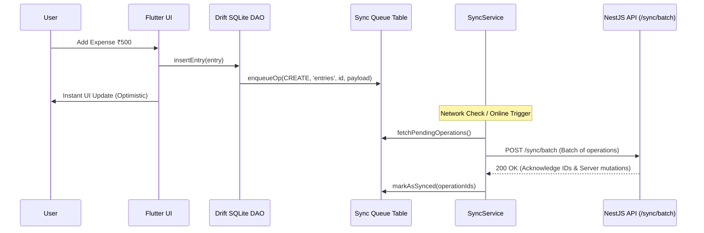

# 3. Frontend Architecture (Flutter)

## 1. Directory Structure & Layering

The mobile application is written in Flutter and follows **Clean Layered Architecture** with distinct presentation, domain, and data layers:

```
lib/
├── app.dart                   # Root MaterialApp with theme, router, and localization
├── main.dart                  # App bootstrap, Riverpod ProviderScope, and DB init
├── core/                      # Cross-cutting foundational services
│   ├── constants/             # Seed data, default categories, app constants
│   ├── network/               # Dio HTTP client, interceptors, auth token handling
│   ├── router/                # GoRouter route definitions and auth guards
│   ├── security/              # App lock, biometric auth, password hashing
│   ├── services/              # Sync engine, connectivity listeners, export services
│   ├── theme/                 # FluidMotion animations, dark/light palette, typography
│   └── utils/                 # Money formatter, date helpers, CSV exporter
├── data/                      # Local and remote persistence layer
│   ├── local/                 # Drift SQLite database (AppDatabase) and DAOs
│   └── remote/                # REST API clients, DTOs, and sync endpoints
├── domain/                    # Pure business logic (Zero Flutter UI dependencies)
│   ├── engine/                # WaterfallEngine, RollupEngine, BudgetEngine, Rollover
│   ├── entities/              # Core domain models (Money, Entry, Category, Account, etc.)
│   └── usecases/              # Use-cases (AddEntry, CloseMonth, ReconcileMonth, etc.)
├── features/                  # 15 domain-focused feature modules
│   ├── accounts/              # Bank & cash accounts management
│   ├── auth/                  # Authentication, login, splash, guest access
│   ├── borrow_lending/        # Informal loans, peer lending, receivables
│   ├── budget/                # Monthly category budget vs. actuals
│   ├── cards/                 # Credit card statements and balance tracking
│   ├── dashboard/             # Waterfall summary, balance widgets, month switcher
│   ├── more/                  # Secondary tools, calculator, settings hub
│   ├── notifications/         # Threshold alerts, upcoming bills, live notifications
│   ├── onboarding/            # First-time household setup wizard
│   ├── planning/              # Forward multi-month forecasting, planned bills
│   ├── protection/            # Sinking funds, insurance, emergency buffers
│   ├── reports/               # Charts, trend analytics, category breakdown
│   ├── saving/                # Retirement, children, and custom savings goals
│   ├── settings/              # App preferences, theme switcher, data export
│   └── transactions/          # Add transaction, custom amount keypad, history
└── shared/                    # Reusable atomic widgets and UI primitives
    └── widgets/               # MoneyText, AmountKeypad, MonthSwitcher, SkeletonLoader
```

---

## 2. State Management with Riverpod

The application uses **Riverpod 2.5+** with code generation (`riverpod_generator`):

- **Data Access via DAOs**: DAOs are injected via Riverpod providers.
- **AsyncValue Handling**: UI widgets utilize `.when(data: ..., loading: ..., error: ...)` for robust UI states.
- **Reactive StreamProviders**: Auto-updating streams from SQLite Drift tables keep the UI perfectly in sync whenever transactions are created or updated.

```dart
// Example: Reactive Stream Provider for Month Entries
@riverpod
Stream<List<Entry>> monthEntries(MonthEntriesRef ref, YearMonth month) {
  final entryDao = ref.watch(entryDaoProvider);
  return entryDao.watchEntriesForMonth(month);
}
```

---

## 3. Local Persistence with Drift (SQLite)

Local offline storage is managed by [AppDatabase](file:///c:/Users/USER/Desktop/caldim%20projects/Budget_tracker_latest/lib/data/local/app_database.dart) using SQLite.

### Key DAOs (Data Access Objects):
1. **[AccountDao](file:///c:/Users/USER/Desktop/caldim%20projects/Budget_tracker_latest/lib/data/local/daos/account_dao.dart)**: Bank accounts, liquid cash, current balances.
2. **[CategoryDao](file:///c:/Users/USER/Desktop/caldim%20projects/Budget_tracker_latest/lib/data/local/daos/category_dao.dart)**: Taxonomy of ~141 categories, group codes, and `isDeduction` flags.
3. **[EntryDao](file:///c:/Users/USER/Desktop/caldim%20projects/Budget_tracker_latest/lib/data/local/daos/entry_dao.dart)**: Core financial ledger entries (income, expense, adjustment, transfer).
4. **[SinkingFundDao](file:///c:/Users/USER/Desktop/caldim%20projects/Budget_tracker_latest/lib/data/local/daos/sinking_fund_dao.dart)**: Sinking funds, monthly reserves, and movement logs.
5. **[SavingGoalDao](file:///c:/Users/USER/Desktop/caldim%20projects/Budget_tracker_latest/lib/data/local/daos/saving_goal_dao.dart)**: Goals, targets, and contribution entries.
6. **[MonthSnapshotDao](file:///c:/Users/USER/Desktop/caldim%20projects/Budget_tracker_latest/lib/data/local/daos/month_snapshot_dao.dart)**: Closed month records, waterfall snapshots, and history.
7. **[SyncQueueDao](file:///c:/Users/USER/Desktop/caldim%20projects/Budget_tracker_latest/lib/data/local/daos/sync_queue_dao.dart)**: Offline mutation queue for cloud synchronization.
8. **[BorrowLendDao](file:///c:/Users/USER/Desktop/caldim%20projects/Budget_tracker_latest/lib/data/local/daos/borrow_lend_dao.dart)**: Tracking informal debt, receivables, and paybacks.
9. **[CreditCardDao](file:///c:/Users/USER/Desktop/caldim%20projects/Budget_tracker_latest/lib/data/local/daos/credit_card_dao.dart)**: Card accounts and credit transactions.

---

## 4. Offline Synchronization Pipeline



---

## 5. Reusable UI Primitives & Design System

The application incorporates a custom design language:

- **`MoneyText`**: Custom animated number ticker utilizing `TweenAnimationBuilder` to smoothly transition monetary amounts without layout jumps.
- **`AmountKeypad`**: Custom in-app financial numpad with instant addition/calculation capabilities for rapid one-handed transaction logging.
- **`MonthSwitcher`**: Horizontal gesture-driven month selector facilitating instant historical and forward navigation.
- **`FluidMotion`**: Curated animation curves and duration tokens ensuring consistent micro-interactions across screen transitions and bottom sheets.
- **`SkeletonLoader`**: Shimmer skeleton placeholder widgets for graceful loading states.
