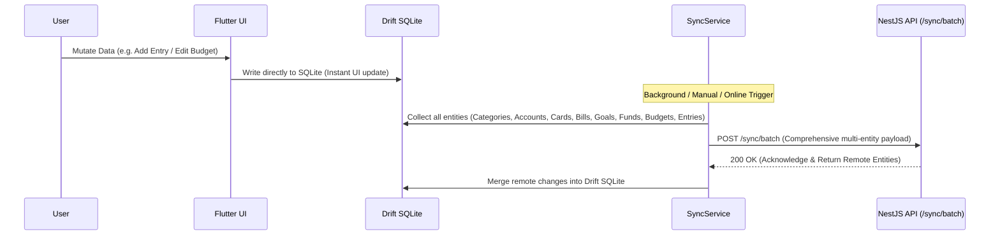

# 3. Frontend Architecture (Flutter)

## 1. Directory Structure & Layering

The mobile application is written in Flutter and follows **Clean Layered Architecture** with distinct presentation, domain, and data layers:

```
lib/
├── app.dart                   # Root MaterialApp with theme, router, and localization
├── main.dart                  # App bootstrap, Riverpod ProviderScope, and DB init
├── core/                      # Cross-cutting foundational services
│   ├── constants/             # Seed data, default categories, app constants
│   ├── network/               # Dio HTTP client, interceptors, auth token handling
│   ├── router/                # GoRouter route definitions and auth guards
│   ├── security/              # AppLockService, LockGate, SecureStore, password hashing
│   ├── services/              # SyncService, AppInitService, export services
│   ├── theme/                 # FluidMotion animations, Material 3 teal palette, typography
│   ├── utils/                 # Money, month, category icons, timezone converters, CSV exporter
│   └── widgets/               # NavShell, global FAB, LockGate, shared primitives
├── data/                      # Local and remote persistence layer
│   ├── local/                 # Drift SQLite database (AppDatabase) and DAOs
│   └── remote/                # REST API clients, DTOs, and sync endpoints
├── domain/                    # Pure business logic (Zero Flutter UI dependencies)
│   ├── engine/                # WaterfallEngine, RollupEngine, BudgetEngine, Rollover
│   ├── entities/              # Core domain models (Money, Entry, Category, Account, etc.)
│   └── usecases/              # Use-cases (AddEntry, CloseMonth, ReconcileMonth, etc.)
├── features/                  # 15 domain-focused feature modules
│   ├── accounts/              # Bank & cash accounts management
│   ├── auth/                  # Authentication, login, splash, guest access, session state
│   ├── borrow_lending/        # Informal loans, peer lending, receivables
│   ├── budget/                # Monthly category budget vs. actuals
│   ├── cards/                 # Credit card statements and balance tracking
│   ├── dashboard/             # Waterfall summary, balance widgets, month switcher
│   ├── more/                  # Secondary tools, calculator, settings hub
│   ├── notifications/         # Threshold alerts, upcoming bills, live notifications
│   ├── onboarding/            # First-time household setup wizard
│   ├── planning/              # Forward multi-month forecasting, planned bills
│   ├── protection/            # Sinking funds, insurance, emergency buffers
│   ├── reports/               # Charts, trend analytics, category breakdown, plan sliders
│   ├── saving/                # Retirement, children, and custom savings goals
│   ├── settings/              # App preferences, household manager, theme, timezone, export
│   └── transactions/          # Add transaction, custom amount keypad, history
└── shared/                    # Reusable atomic widgets and UI primitives
    └── widgets/               # MoneyText, AmountKeypad, MonthSwitcher, SkeletonLoader
```

---

## 2. State Management with Riverpod

The application uses **Riverpod 2.5+** with code generation (`riverpod_generator`):

- **Data Access via DAOs**: DAOs are injected via Riverpod providers (`ref.watch(entryDaoProvider)`).
- **AsyncValue Handling**: UI widgets utilize `.when(data: ..., loading: ..., error: ...)` for robust, reactive UI states.
- **Reactive StreamProviders**: Auto-updating streams from SQLite Drift tables keep the UI perfectly in sync whenever transactions or balances change.

```dart
// Example: Reactive Stream Provider for Month Entries
@riverpod
Stream<List<Entry>> monthEntries(MonthEntriesRef ref, YearMonth month) {
  final entryDao = ref.watch(entryDaoProvider);
  return entryDao.watchEntriesForMonth(month);
}
```

---

## 3. Local Persistence with Drift (SQLite)

Local offline storage is managed by [AppDatabase](file:///c:/Users/USER/Desktop/caldim%20projects/Budget_tracker_latest/lib/data/local/app_database.dart) using SQLite (`drift` and `sqlite3_flutter_libs`).

### Key DAOs (Data Access Objects):
1. **[AccountDao](file:///c:/Users/USER/Desktop/caldim%20projects/Budget_tracker_latest/lib/data/local/daos/account_dao.dart)**: Bank accounts, liquid cash, and verified balances.
2. **[CategoryDao](file:///c:/Users/USER/Desktop/caldim%20projects/Budget_tracker_latest/lib/data/local/daos/category_dao.dart)**: Taxonomy of ~141 categories, group codes, and `isDeduction` flags.
3. **[EntryDao](file:///c:/Users/USER/Desktop/caldim%20projects/Budget_tracker_latest/lib/data/local/daos/entry_dao.dart)**: Core financial ledger entries (income, expense, adjustment, transfer).
4. **[SinkingFundDao](file:///c:/Users/USER/Desktop/caldim%20projects/Budget_tracker_latest/lib/data/local/daos/sinking_fund_dao.dart)**: Sinking funds, monthly reserves, and movement logs.
5. **[SavingGoalDao](file:///c:/Users/USER/Desktop/caldim%20projects/Budget_tracker_latest/lib/data/local/daos/saving_goal_dao.dart)**: Goals, targets, and contribution entries.
6. **[MonthSnapshotDao](file:///c:/Users/USER/Desktop/caldim%20projects/Budget_tracker_latest/lib/data/local/daos/month_snapshot_dao.dart)**: Closed month records, waterfall snapshots, and history.
7. **[SyncQueueDao](file:///c:/Users/USER/Desktop/caldim%20projects/Budget_tracker_latest/lib/data/local/daos/sync_queue_dao.dart)**: Offline mutation queue for cloud synchronization.
8. **[BorrowLendDao](file:///c:/Users/USER/Desktop/caldim%20projects/Budget_tracker_latest/lib/data/local/daos/borrow_lend_dao.dart)**: Tracking informal debt, receivables, and paybacks.
9. **[CreditCardDao](file:///c:/Users/USER/Desktop/caldim%20projects/Budget_tracker_latest/lib/data/local/daos/credit_card_dao.dart)**: Card accounts and credit transactions.

---

## 4. Multi-Entity Offline Synchronization Pipeline

The [SyncService](file:///c:/Users/USER/Desktop/caldim%20projects/Budget_tracker_latest/lib/core/services/sync_service.dart) provides a robust bidirectional sync mechanism:



### Synchronized Entities:
1. **Categories**: System & custom category taxonomy.
2. **Accounts**: Cash & bank account balances.
3. **Credit Cards & Card Transactions**: Credit card balances and statements.
4. **Planned Bills**: Future payables and payment tracking.
5. **Receivables**: Peer lending and informal loans.
6. **Saving Goals & Goal Contributions**: Multi-bucket savings tracking.
7. **Sinking Funds & Fund Movements**: Protection reserve allocations.
8. **Budgets**: Category-level monthly spending limits.
9. **Entries**: Main double-entry financial ledger records.

---

## 5. Security & App Lock Architecture

The app includes native device-level authentication:

- **[AppLockService](file:///c:/Users/USER/Desktop/caldim%20projects/Budget_tracker_latest/lib/core/security/app_lock_service.dart)**: Interacts with `local_auth` to authenticate users via device credentials (Fingerprint, Face ID, PIN, pattern, password).
- **[LockGate](file:///c:/Users/USER/Desktop/caldim%20projects/Budget_tracker_latest/lib/core/widgets/lock_gate.dart)**: App-level lifecycle wrapper widget that intercepts Flutter lifecycle state changes (`AppLifecycleState.paused` / `resumed`) and enforces an authentication lock screen after configurable timeout intervals.
- **[SecureStore](file:///c:/Users/USER/Desktop/caldim%20projects/Budget_tracker_latest/lib/core/security/secure_store.dart)**: Encrypted keychain/keystore storage via `flutter_secure_storage` for JWT tokens, active household IDs, and lock configuration flags.

---

## 6. Semantic Category Icon Engine

The [category_icons.dart](file:///c:/Users/USER/Desktop/caldim%20projects/Budget_tracker_latest/lib/core/utils/category_icons.dart) engine maps category names to Material 3 icons using fuzzy keyword analysis:

- **60+ Semantic Keywords**: Accurately maps terms like "groceries", "dining", "pet", "gym", "electricity", "insurance", "salary", "bonus", "sip", "rent", etc.
- **Kind-Tinted Colors**:
  - `income`: Emerald Green (`0xFF10B981`)
  - `expense` / `spending`: Vibrant Red / Orange (`0xFFEF4444`)
  - `protection`: Slate Blue (`0xFF3B82F6`)
  - `saving`: Royal Purple (`0xFF8B5CF6`)
  - `adjustment`: Amber (`0xFFF59E0B`)

---

## 7. Plan Distribution Customizer in Reports

Located in [report_detail_screen.dart](file:///c:/Users/USER/Desktop/caldim%20projects/Budget_tracker_latest/lib/features/reports/presentation/report_detail_screen.dart):
- Displays interactive ratio sliders for **Spending**, **Saving**, and **Protection**.
- Features **Lock Toggles**: Users can lock one or two categories while dynamically adjusting the remainder.
- Calculates live Drift actuals vs. planned budget targets in real time.

---

## 8. Timezone Localization Engine

Located in [timezone_utils.dart](file:///c:/Users/USER/Desktop/caldim%20projects/Budget_tracker_latest/lib/core/utils/timezone_utils.dart):
- Encapsulates 24 worldwide timezone offsets.
- Seamlessly converts UTC database timestamps to the user's selected timezone for date group headings, entry logs, and monthly reports.
